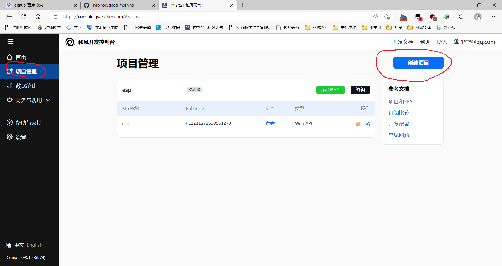
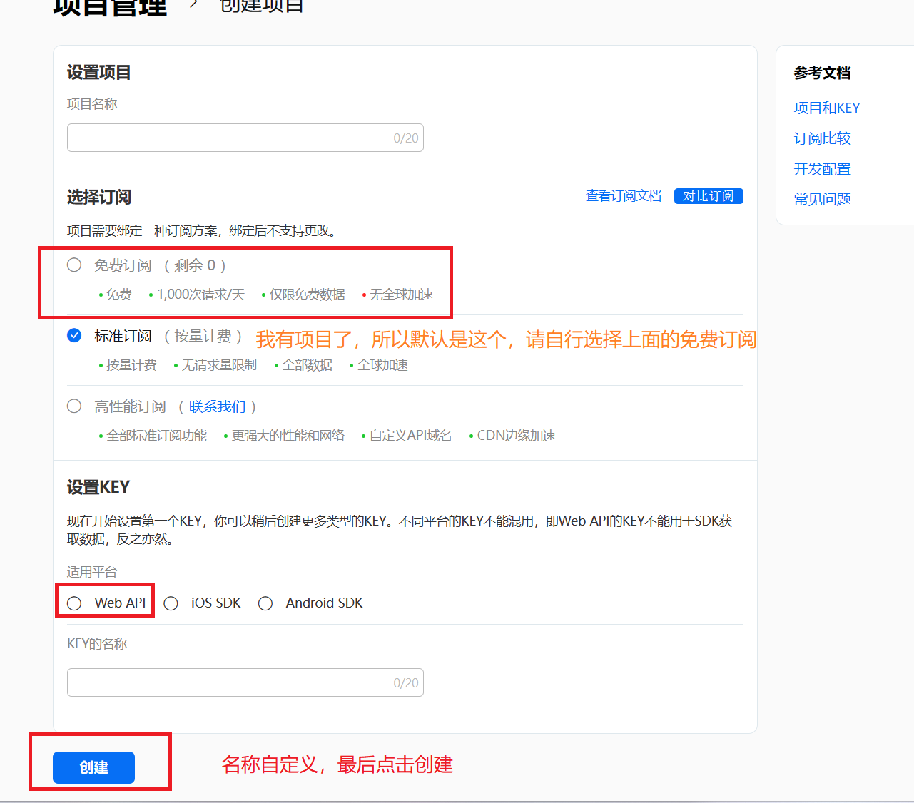
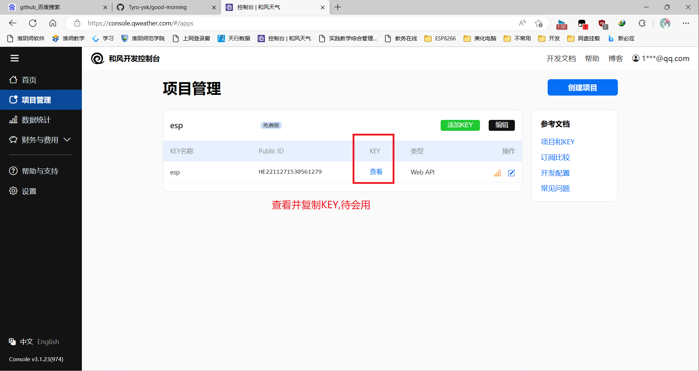
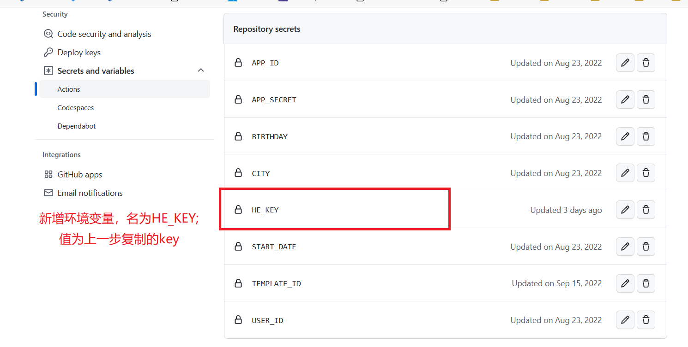

# 原作者介绍及教程
[原作者介绍及教程](./original_author/authorship.md)

# 本教程
本教程只添加一小部分内容，详细教程请看[原教程](./original_author/authorship.md)
### 注册和风天气接口
[和风登录界面，可以注册](https://id.qweather.com/#/login)

### 创建项目
#### 注意：由于我有项目了，所以教程中的截图可能和你看到的不一样

### 添加环境变量
这里只有添加一个的教程，其他的请回[原教程](./original_author/authorship.md)
